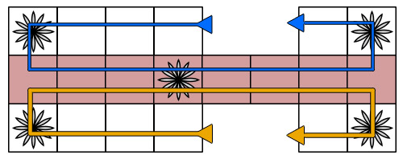

# AI Agent for the Royal Game of Ur

**Requirements**: Python 3.5 or greater. Viewing the game board requires a unicode capable terminal.

## Overview

This is an implementation of the Royal Game of Ur, along with several varieties of agents to play the game.

### The Royal Game of Ur Rules

The Royal Game of Ur is a race game in which each player must get their four pieces to the end of the board before their opponent.
As a side note, the standard rules of the Game of Ur usually use seven pieces per player, however I have chosen to use four pieces for the sake of manageability.
The program allows for an arbitrary number of pieces, but I have used four for most of my testing and development.

The game board is split into three sections: each player has a starting safe zone which is four squares long.
Next, there is a shared combat zone that is eight squares long, in which pieces can knock opponent's pieces off the board.
Finally, there is a ending safe zone which is two squares in length followed by the end-zone.
Additionally, there are five "rosette" squares on the board: one in each player's starting zone, one in the combat zone, and one in each player's ending zone.
When a piece lands on a rosette, the owner of that piece gets another move.
Additionally, the rosette in the combat zone serves as another safe zone for whichever piece occupies it.
The board, along with the path pieces take along it, is depicted in image below.

To move their pieces, players flip four coins and move a single piece a number of squares equal to the number of heads flipped.
This stochastic element makes for an interesting challenge in an AI agent.

## Current Progress

Each turn, each agent is given a list of legal moves, and the agent must choose a move from this list to play.
Currently, I have several agents implemented:

- A human player, which queries the user for moves.
- A random player, which chooses a random move from the available moves.
- A greedy player, which rates the destination state of all available moves and chooses the one with the highest score.
  - This is accomplished by giving each tile a rating, and multiplying the number of pieces on a tile by that tile's rating.
  Opponent pieces count negatively.
- A learning greedy player, which is similar to the standard greedy player, except that after each game, it adjusts the tile ratings it uses based on whether it won or lost.
  - This uses a tree structure and algorithm reminiscent of a Monte-Carlo Tree Search.
  Each node of the tree contains a list of tile ratings.
  When a game is completed, the results of the game are propagated up the tree to all ancestors of the current node.
  For the next game, a new list of tile ratings is generated by finding the best candidate in the tree using the formula below, and creating a new, mutated child of that best candidate.

As of right now, the best agent is a Greedy Player using the learned tile values from a Learning Greedy Player.
Best results are achieved when training two Learning Greedy Players against one another.
More games will result in better learned tile values, however reasonably good results can be achieved with about 10,000 games.
Under such circumstances, a Greedy Player using values learned by a Learning Greedy Player can achieve a ~90% win rate against a random agent, and a ~70% win rate against the next best Greedy Agent.

## Future Plans

In the future I plan to implement an agent that looks deeper into the state tree, beyond just the current move and at the opponent's next move.
This is a complicated issue as you must account for the stochastic nature of the game, and make judgments about which of the opponent's moves are most likely to occur.