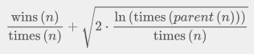

# AI Agent for the Royal Game of Ur

**Requirements**: Python 3.5 or greater. Viewing the game board requires a unicode capable terminal.

## Overview

This is an implementation of the Royal Game of Ur, along with several varieties of agents to play the game.

### The Royal Game of Ur Rules

The Royal Game of Ur is a race game in which each player must get their four pieces to the end of the board before their opponent.
As a side note, the standard rules of the Game of Ur usually use seven pieces per player, however I have chosen to use four pieces for the sake of manageability.
The program allows for an arbitrary number of pieces, but I have used four for most of my testing and development.

The game board is split into three sections: each player has a starting safe zone which is four squares long.
Next, there is a shared combat zone that is eight squares long, in which pieces can knock opponent's pieces off the board.
Finally, there is a ending safe zone which is two squares in length followed by the end-zone.
Additionally, there are five "rosette" squares on the board: one in each player's starting zone, one in the combat zone, and one in each player's ending zone.
When a piece lands on a rosette, the owner of that piece gets another move.
Additionally, the rosette in the combat zone serves as another safe zone for whichever piece occupies it.
The board, along with the path pieces take along it, is depicted in image below.

To move their pieces, players flip four coins and move a single piece a number of squares equal to the number of heads flipped.
This stochastic element makes for an interesting challenge in an AI agent.

## Current Progress

Each turn, each agent is given a list of legal moves, and the agent must choose a move from this list to play.
Currently, I have several agents implemented:

- A human player, which queries the user for moves.
- A random player, which chooses a random move from the available moves.
- A greedy player, which rates the destination state of all available moves and chooses the one with the highest score.
  - This is accomplished by giving each tile a rating, and multiplying the number of pieces on a tile by that tile's rating.
  Opponent pieces count negatively.
- A learning greedy player, which is similar to the standard greedy player, except that after each game, it adjusts the tile ratings it uses based on whether it won or lost.
  - This uses a tree structure and algorithm reminiscent of a Monte-Carlo Tree Search.
  - The algorithm is explained in greater detail below.
  
As of right now, the best agent is a Greedy Player using the learned tile values from a Learning Greedy Player.
Best results are achieved when training two Learning Greedy Players against one another.
More games will result in better learned tile values, however reasonably good results can be achieved with about 10,000 games.
Under such circumstances, a Greedy Player using values learned by a Learning Greedy Player can achieve a ~90% win rate against a random agent, and a ~70% win rate against the next best Greedy Agent.

## Future Plans

In the future I plan to implement an agent that looks deeper into the state tree, beyond just the current move and at the opponent's next move.
This is a complicated issue as you must account for the stochastic nature of the game, and make judgments about which of the opponent's moves are most likely to occur.

## Explanation of the Learning Algorithm

The `GreedyLearningAIPlayer` "learns" over a series of games.
Over this series of games, it develops a list of scores for each tile, which I call the "brain".
After each game it generates a new brain for the next game by selecting a "best candidate" from the previously generated brains and mutating it by perturbing one of the values in the brain by a configurable amount.

The key to the algorithm is selecting this "best candidate".
It does this using an algorithm reminiscent of Monte-Carlo tree search.
It holds a tree of previous brains, in which each brain is the child of the brain from which it was originally mutated.
In a Monte-Carlo tree search, the algorithm determines which branch of the tree to explore using an "upper confidence bound" formula, which is performed for each node, and the branches with the highest UCB values are taken.
The UCB formula is depicted below.
This formula is carefully balanced to favor exploring branches which win a lot (so as not to waste time exploring bad branches), but also will explore "bad" branches in case there is a good path within this "bad" branch.

The same formula is used to select a "best candidate" in the `GreedyLearningAIPlayer`.
However, unlike a Monte-Carlo tree search, which *explores* a state tree that already exists, the learning player *generates* a tree, choosing to expand brain nodes which have produced good results so far.
In Monte-Carlo tree search, the algorithm follows the branch with the highest UCB at each layer until it reaches a leaf node, then picks randomly until a resolution, then the number of wins and number of games played are propagated up the tree through the nodes chosen at each layer and used to calculate the UCB values for the next iteration.
The learning player uses a very similar approach including the upward propagation of wins and total games, though if it used the same method of choosing nodes to expand the tree would simply be a line straight down, as since it develops the tree as it goes, it would never come to a branch.
For this reason, rather choosing the better branch until it reaches a leaf node to expand, it simply selects the single node with the highest UCB to expand, and adds a new child to that node.

As a result of this, the tree of "brains" generated is reasonably balanced and usually each node has relatively few children (even after many iterations, typically no more than 3 children for a given node), as the algorithm prefers expanding a descendant rather than continually expanding a higher up brain.
I take this as an indication that the learner does not try incremental variations on the same brain, rather it broadly creates variants and explores them relatively evenly, with emphasis on expanding nodes which have produced good results in the past, which is exactly what I was going for.
A typical tree after 100 iterations is depicted below.
Each node contains an ID number, as well as the number of wins over total number of runs through that node or descendants of that node.

